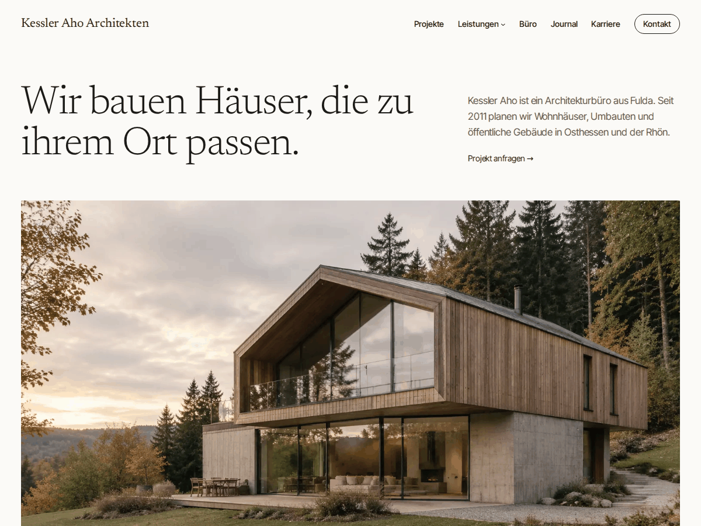

# Webfire Starter

WordPress-Block-Theme von [Webfire Marketing](https://webfire-marketing.com). Wir nutzen es als Startpunkt für Websites von Büros, Praxen und kleinen Firmen. Die Demo-Inhalte gehören zu einem erfundenen Architekturbüro (Kessler Aho Architekten).

Das Theme funktioniert als Onepager oder als Website mit Unterseiten. Die Demo zeigt die Variante mit Unterseiten, der Onepager liegt als Pattern bei.

**[Live-Demo öffnen](https://playground.wordpress.net/?blueprint-url=https://raw.githubusercontent.com/Webfire-Marketing/webfire-starter/main/blueprint.json)** (WordPress Playground, läuft komplett im Browser)



## Inhalt

- `theme.json` mit Farben, Schriftgrößen, Abständen und Element-Styles
- Schriften Newsreader und Inter Tight, lokal eingebunden
- Custom Post Types `projekt` und `team`, Taxonomie `leistung` mit Filterseiten unter `/projekte/leistung/…`
- Meta-Felder (Ort, Jahr, Rolle) werden über Block Bindings ausgegeben, ACF ist nicht nötig
- Templates für Startseite, Journal, Archive, Projekte, Seiten und 404
- Patterns für einzelne Sektionen und komplette Seiten (Büro, Leistungen, Kontakt, Karriere, Onepager)
- Header, Footer und 404 sind Patterns, damit die Links per `home_url()` auch in Unterordnern stimmen
- Eigener Block `webfire/kontaktformular` (serverseitig gerendert, kein Build-Step)
- Formular-Handler mit Nonce, Honeypot und Mindestzeit, Versand per `wp_mail()`, danach Weiterleitung auf `/danke/`
- `inc/cleanup.php` entfernt Emoji-Script, Generator-Tag, XML-RPC und Autorenarchive

## Struktur

```
assets/        CSS, Schriften, Demo-Bilder
blocks/        Kontaktformular-Block
inc/           setup, cleanup, contact-form, projects, team
parts/         header.html, footer.html
patterns/
templates/
blueprint.json Demo-Setup für Playground
```

## Installation

1. Ordner nach `wp-content/themes/` kopieren oder als ZIP hochladen, Theme aktivieren.
2. Permalinks einmal speichern.
3. Projekte und Team-Mitglieder anlegen. Ort, Jahr und Rolle stehen unter *Individuelle Felder* (im Editor über *Optionen → Einstellungen → Bedienfelder* einblenden).
4. Seiten für Büro, Leistungen, Kontakt und Karriere mit der Vorlage *Seite ohne Titel* anlegen und das passende Pattern einfügen. Für einen Onepager reicht das Pattern *Onepager komplett*.
5. Seite `/danke/` anlegen.

Anfragen gehen an die Admin-Mail. Ändern lässt sich das per Filter:

```php
add_filter( 'webfire_starter_contact_recipient', fn() => 'anfragen@example.com' );
```

Voraussetzungen: WordPress 6.5, PHP 8.1

## Hinweise

Die Post Types liegen hier im Theme, damit alles in einem Repo ist. In Kundenprojekten gehören sie in ein Plugin, sonst sind die Inhalte nach einem Theme-Wechsel nicht mehr erreichbar.

Kein Captcha: Honeypot und Zeitprüfung reichen für die meisten Bots und kommen ohne Drittanbieter aus.

## Lizenz

GPL-2.0-or-later. Schriften unter SIL Open Font License 1.1. Die Demo-Bilder sind KI-generiert.
